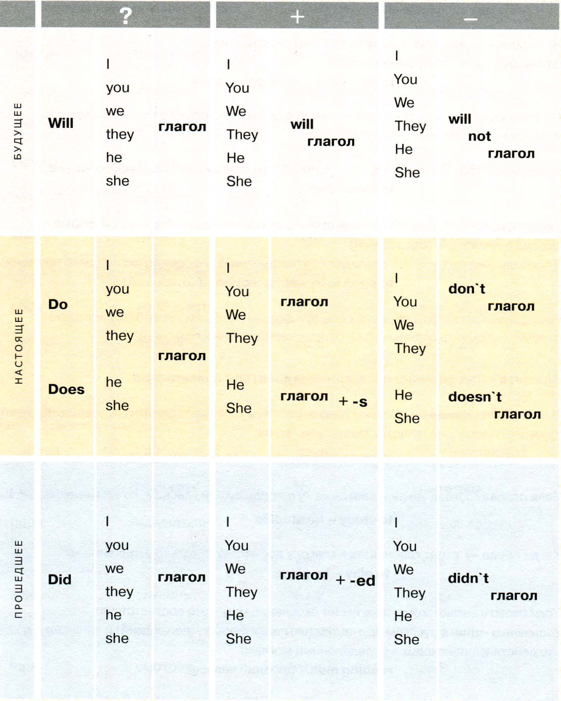
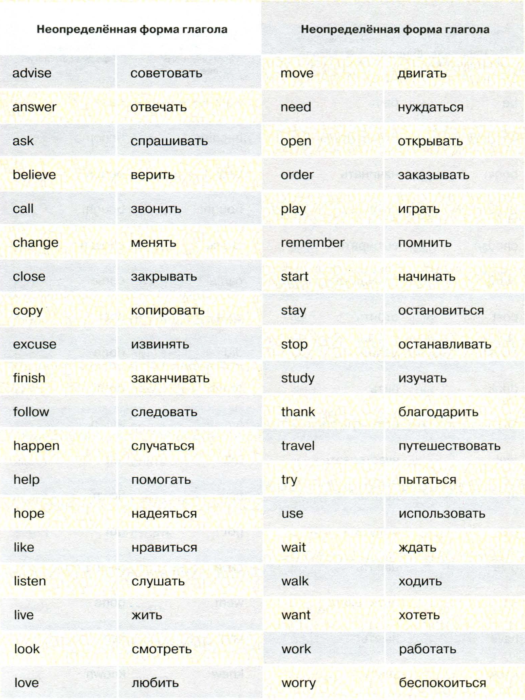
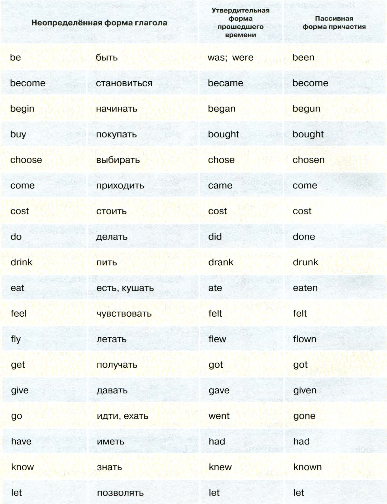
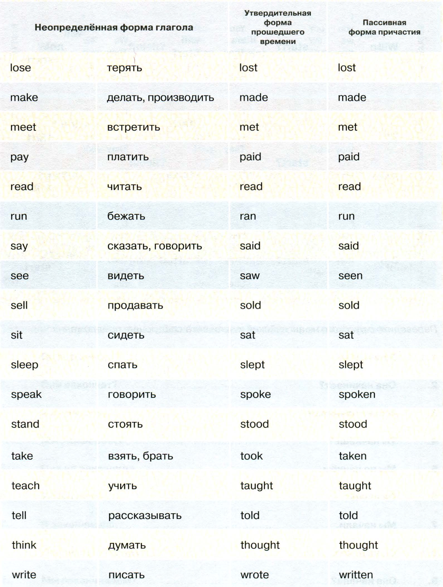

# Lesson 1

> ...По статистике, 300-400 самых употребительных
> слов охватывают 90% лексики, используемой
> в разговорной речи. Свобода в общении возникает
> не от знания огромного количества слов,
> а от умения составлять даже из небольшого числа
> элементов большое количество комбинаций...

## Алгоритм глагола в английском языке

:::tip
В каждом языке есть свой алгоритм использования глаголов, то есть слов,
означающих действие.
:::

Начнём с форм глагола, наиболее употребительных в английском языке.

Любое действие происходит в **настоящем**, **будущем** или **прошедшем** времени.

При этом мы что-то **утверждаем (+)**, **отрицаем (-)** или **задаём вопрос (?)**.
Соответственно, мы получаем всего девять возможных вариантов предложений,
описывающих действие (см. таблицу).

Для каждого из этих девяти вариантов установлен свой строгий порядок слов
в предложении. В английском языке при нарушении этой последовательности
теряется общий смысл.

Обычный порядок слов для различных форм предложений отражён в нашей таблице.

:::tip
В качестве подлежащего мы используем личные местоимения в основной форме.
:::

| I   | you | we  | they | he  | she |
| --- | --- | --- | ---- | --- | --- |
| Я   | ты  | вы  | они  | он  | она |

- Для образования форм будущего времени используется вспомогательный
  глагол **will**. В зависимости от формы предложения меняется его место.

- Для образования вопросительной и отрицательной формы от всех глаголов
  в настоящем или прошедшем времени используется глагол **do (does, did)**.

- В отрицательных предложениях к глаголу **do** добавляется частица **not**.
  На письме и в речи часто допускается сокращение:

  **do not - don't**

  **does not - doesn't**

  **did not - didn't**

Утвердительные предложения в настоящем и прошедшем времени образуются
без вспомогательных глаголов.

## Правильные и неправильные глаголы

:::tip
Итак, глагол - это слово, которое обозначает действие.
:::

На вопрос **что делать?** отвечают глаголы с частицей **to**.
Это неопределённая форма глагола:
**to be** - быть **to do** - делать

По способу образования утвердительной формы прошедшего времени глаголы
делятся на правильные и неправильные.

Правильные глаголы образуют эту форму путем прибавления окончания **-d,-ed**:
**to love - loved**

Третья форма английского глагола примерно соответствует пассивной форме
русского причастия (сдела**нный**).
У правильных глаголов она совпадает с утвердительной формой прошедшего времени:
**to open** (открывать) - **opened** (открытый)

Неправильные глаголы образуют обе эти формы особыми способами, которые
следует запомнить отдельно (см. список неправильных глаголов).

**Большая часть английских глаголов относится к правильным.**

В настоящем времени в третьем лице единственного числа (он, она) в утвердительной
форме к глаголу добавляется окончание **-s,-es**:
**to want - he wants to go - she goes**

Если основа глагола заканчивается на **-у** с предыдущей гласной, то **y** изменяется на **i**:
**to study - he studies**

Когда перед **-у** стоит гласная, то к глаголу добавляется только окончание **-s**:
**to play - he plays**

Если слово в английском языке имеет окончание **-ing** - это соответствует
окончанию **-щий** в русском причастии (активная форма - дела**ющий**) и означает,
что действие происходит в определённый момент:
**running man** - бегущий человек

 

 

 

## Тренировка

<QuestionFormList :data="data" />
